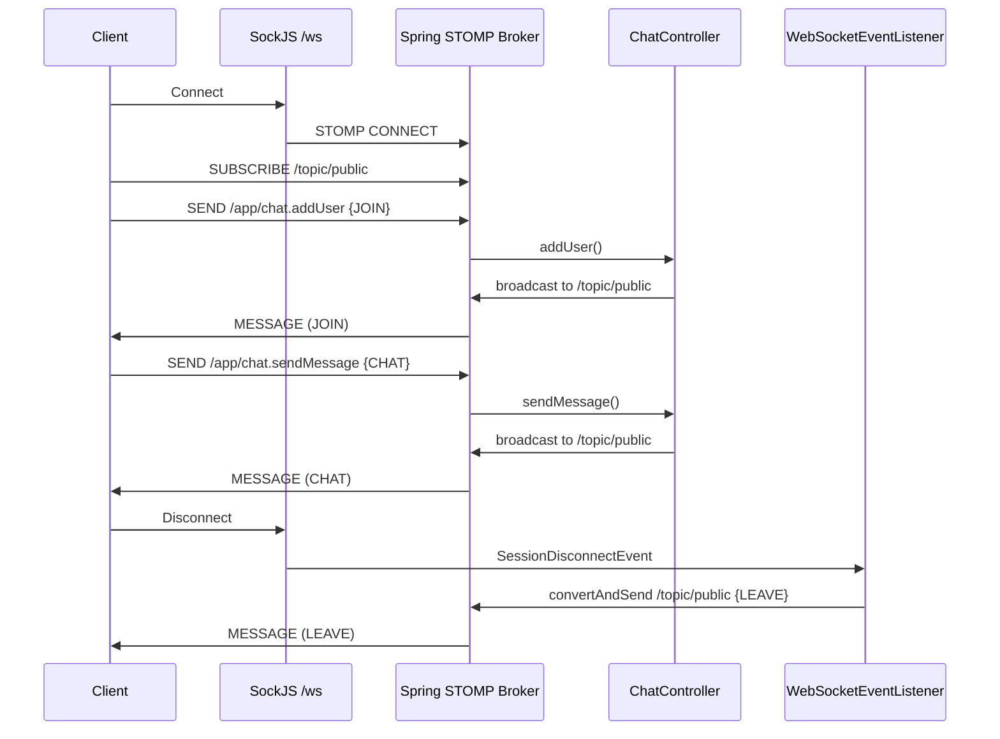

# Spring WebSockets Guide — chatApp Backend & React Frontend

This document explains how real-time messaging is built in this project using **Spring WebSocket + STOMP**, and how a **React** frontend connects to it.

---

## Table of Contents

1. [Architecture Overview](#architecture-overview)
2. [Technology Stack](#technology-stack)
3. [Backend Components](#backend-components)
4. [Message Flow](#message-flow)
5. [STOMP Destinations Reference](#stomp-destinations-reference)
6. [Message Contract](#message-contract)
7. [Reference Client (Vanilla JS)](#reference-client-vanilla-js)
8. [React Frontend Integration](#react-frontend-integration)
9. [Development Setup](#development-setup)
10. [Production Considerations](#production-considerations)
11. [Extending the App](#extending-the-app)

---

## Architecture Overview

This app uses a layered real-time stack:

```
React (or browser)
    │
    │  SockJS client  ──►  HTTP upgrade / fallback transports
    │
    ▼
STOMP protocol  ──►  framed messages (subscribe, send, etc.)
    │
    ▼
Spring WebSocket Message Broker
    │
    ├── @MessageMapping handlers  (incoming from clients → /app/*)
    └── Simple in-memory broker    (outgoing broadcasts → /topic/*)
```

**Key idea:** Clients do not talk to `@MessageMapping` URLs directly. They:

1. Open a WebSocket (via SockJS) at `/ws`
2. Send STOMP frames to **application destinations** prefixed with `/app`
3. Subscribe to **broker destinations** prefixed with `/topic`

Spring routes `/app/chat.sendMessage` to `ChatController.sendMessage()`, which returns a `ChatMessage` that gets broadcast to `/topic/public` for all subscribers.



---

## Technology Stack

| Layer | Library / Feature |
|-------|-------------------|
| Server framework | Spring Boot 4.x |
| WebSocket support | `spring-boot-starter-websocket` |
| Messaging protocol | STOMP over WebSocket |
| Transport fallback | SockJS (for browsers/proxies that block raw WebSockets) |
| Client (reference) | `sockjs-client` + `stompjs` (CDN in `static/index.html`) |
| Client (React) | `@stomp/stompjs` + `sockjs-client` (recommended npm packages) |

---

## Backend Components

### 1. Dependency — `pom.xml`

```xml
<dependency>
    <groupId>org.springframework.boot</groupId>
    <artifactId>spring-boot-starter-websocket</artifactId>
</dependency>
```

This brings in Spring's WebSocket, STOMP, and messaging infrastructure.

---

### 2. WebSocket Configuration — `WebSocketConfig.java`

```java
@Configuration
@EnableWebSocketMessageBroker
public class WebSocketConfig implements WebSocketMessageBrokerConfigurer {

    @Override
    public void registerStompEndpoints(StompEndpointRegistry registry) {
        registry.addEndpoint("/ws").withSockJS();
    }

    @Override
    public void configureMessageBroker(MessageBrokerRegistry registry) {
        registry.setApplicationDestinationPrefixes("/app");
        registry.enableSimpleBroker("/topic");
    }
}
```

| Setting | Value | Meaning |
|---------|-------|---------|
| STOMP endpoint | `/ws` | URL clients connect to (SockJS adds sub-paths like `/ws/info`) |
| SockJS | enabled | Provides WebSocket with HTTP long-polling fallback |
| Application prefix | `/app` | Client sends here; routes to `@MessageMapping` methods |
| Broker prefix | `/topic` | Server broadcasts here; clients subscribe |

> **Note:** `@EnableWebSocket` is imported in the file but not used. `@EnableWebSocketMessageBroker` is the annotation that matters for STOMP.

---

### 3. Chat Controller — `ChatController.java`

Handles two client actions:

| `@MessageMapping` | Purpose |
|-------------------|---------|
| `/chat.sendMessage` | Client sends a chat message → broadcast to all |
| `/chat.addUser` | Client announces username on join → broadcast JOIN event |

Both methods use `@SendTo("/topic/public")`, so the return value is automatically published to that topic.

**Session attribute on join:** `addUser` stores the username in the WebSocket session:

```java
headerAccessor.getSessionAttributes().put("username", chatMessage.getSender());
```

This is used later when the user disconnects.

---

### 4. Disconnect Listener — `WebSocketEventListener.java`

Listens for `SessionDisconnectEvent`. When a user disconnects:

1. Reads `username` from session attributes (set during `addUser`)
2. Builds a `ChatMessage` with `type: LEAVE`
3. Broadcasts via `SimpMessageSendingOperations.convertAndSend("/topic/public", ...)`

Unlike `@SendTo`, this uses imperative sending because there is no `@MessageMapping` handler for disconnects — disconnect is a lifecycle event, not a client message.

---

### 5. Data Model

**`ChatMessage.java`**

```java
public class ChatMessage {
    private String content;
    private String sender;
    private MessageType type;
}
```

**`MessageType.java`**

```java
public enum MessageType {
    CHAT, JOIN, LEAVE
}
```

Serialized over the wire as JSON strings: `"CHAT"`, `"JOIN"`, `"LEAVE"`.

---

## Message Flow

### User joins

1. Client connects to `/ws` via SockJS
2. Client subscribes to `/topic/public`
3. Client sends to `/app/chat.addUser`:
   ```json
   { "sender": "alice", "type": "JOIN" }
   ```
4. Server stores `alice` in session, broadcasts JOIN message to `/topic/public`
5. All clients (including alice) receive the JOIN notification

### User sends a message

1. Client sends to `/app/chat.sendMessage`:
   ```json
   { "sender": "alice", "content": "Hello!", "type": "CHAT" }
   ```
2. Controller returns the same object → broadcast to `/topic/public`
3. All subscribed clients render the message

### User leaves

1. Client closes tab / disconnects
2. `WebSocketEventListener` fires
3. Server broadcasts:
   ```json
   { "sender": "alice", "type": "LEAVE" }
   ```

---

## STOMP Destinations Reference

| Direction | Destination | Handler |
|-----------|-------------|---------|
| Client → Server | `/app/chat.addUser` | `ChatController.addUser()` |
| Client → Server | `/app/chat.sendMessage` | `ChatController.sendMessage()` |
| Server → Client | `/topic/public` | Subscribe once after connect |

**Full client paths:**

- Connect: `http://localhost:8080/ws` (SockJS)
- Subscribe: `/topic/public`
- Send join: `/app/chat.addUser`
- Send chat: `/app/chat.sendMessage`

---

## Message Contract

All messages on `/topic/public` follow this shape:

```typescript
interface ChatMessage {
  sender: string;
  content?: string;   // absent on JOIN/LEAVE
  type: 'CHAT' | 'JOIN' | 'LEAVE';
}
```

| type | content | UI behavior (reference client) |
|------|---------|--------------------------------|
| `JOIN` | optional | Show "{sender} joined!" |
| `LEAVE` | optional | Show "{sender} left!" |
| `CHAT` | required | Show avatar + sender + message body |

---

## Reference Client (Vanilla JS)

The backend ships a working demo at `src/main/resources/static/`:

- `index.html` — loads SockJS + STOMP from CDN
- `js/main.js` — connection, subscribe, send, render logic

Connection pattern (simplified):

```javascript
const socket = new SockJS('/ws');
const stompClient = Stomp.over(socket);

stompClient.connect({}, () => {
  stompClient.subscribe('/topic/public', onMessageReceived);

  stompClient.send('/app/chat.addUser', {},
    JSON.stringify({ sender: username, type: 'JOIN' })
  );
});

// Send a chat message
stompClient.send('/app/chat.sendMessage', {},
  JSON.stringify({ sender: username, content: text, type: 'CHAT' })
);
```

Because the static files are served from the same origin as the WebSocket endpoint, no CORS configuration is needed for the built-in demo.

---

## React Frontend Integration

The `chatFrontend` Vite app runs on a **different origin** (default `http://localhost:5173`) than Spring Boot (`http://localhost:8080`). You need:

1. npm STOMP + SockJS clients
2. CORS / allowed origins on the backend
3. A React hook or service to manage the connection lifecycle

### Step 1 — Install client libraries

```bash
cd chatFrontend
npm install @stomp/stompjs sockjs-client
```

`@stomp/stompjs` is the maintained STOMP client (preferred over legacy `stompjs`).

### Step 2 — Enable CORS on the backend

Add allowed origins to `WebSocketConfig.java`:

```java
@Override
public void registerStompEndpoints(StompEndpointRegistry registry) {
    registry.addEndpoint("/ws")
            .setAllowedOriginPatterns("*")  // tighten in production
            .withSockJS();
}
```

For production, replace `*` with your React app's URL, e.g. `https://myapp.com`.

You may also add a `@Configuration` class with `@CrossOrigin` for REST endpoints if you add HTTP APIs later.

### Step 3 — Vite dev proxy (optional alternative to CORS)

Instead of CORS, proxy WebSocket traffic through Vite during development:

```js
// chatFrontend/vite.config.js
export default defineConfig({
  plugins: [react()],
  server: {
    proxy: {
      '/ws': {
        target: 'http://localhost:8080',
        ws: true,
        changeOrigin: true,
      },
    },
  },
});
```

With this proxy, connect to `/ws` (relative URL) from React — same pattern as the static demo.

### Step 4 — WebSocket service module

Create `src/services/chatSocket.js`:

```javascript
import { Client } from '@stomp/stompjs';
import SockJS from 'sockjs-client';

const WS_URL = import.meta.env.VITE_WS_URL ?? 'http://localhost:8080/ws';

export function createChatClient({ onMessage, onConnect, onError }) {
  const client = new Client({
    webSocketFactory: () => new SockJS(WS_URL),
    reconnectDelay: 5000,
    onConnect: () => {
      client.subscribe('/topic/public', (frame) => {
        onMessage(JSON.parse(frame.body));
      });
      onConnect?.(client);
    },
    onStompError: (frame) => {
      onError?.(frame.headers['message'] ?? 'STOMP error');
    },
  });

  client.activate();
  return client;
}

export function joinChat(client, username) {
  client.publish({
    destination: '/app/chat.addUser',
    body: JSON.stringify({ sender: username, type: 'JOIN' }),
  });
}

export function sendChatMessage(client, username, content) {
  client.publish({
    destination: '/app/chat.sendMessage',
    body: JSON.stringify({ sender: username, content, type: 'CHAT' }),
  });
}
```

### Step 5 — React component example

```jsx
import { useEffect, useRef, useState } from 'react';
import {
  createChatClient,
  joinChat,
  sendChatMessage,
} from './services/chatSocket';

export default function ChatRoom({ username }) {
  const [messages, setMessages] = useState([]);
  const [input, setInput] = useState('');
  const clientRef = useRef(null);

  useEffect(() => {
    const client = createChatClient({
      onMessage: (msg) => setMessages((prev) => [...prev, msg]),
      onConnect: (c) => joinChat(c, username),
      onError: (err) => console.error(err),
    });
    clientRef.current = client;

    return () => client.deactivate();
  }, [username]);

  const handleSend = (e) => {
    e.preventDefault();
    if (!input.trim() || !clientRef.current) return;
    sendChatMessage(clientRef.current, username, input.trim());
    setInput('');
  };

  return (
    <div>
      <ul>
        {messages.map((msg, i) => (
          <li key={i}>
            {msg.type === 'CHAT' && (
              <strong>{msg.sender}: </strong>
            )}
            {msg.type === 'JOIN' && `${msg.sender} joined!`}
            {msg.type === 'LEAVE' && `${msg.sender} left!`}
            {msg.type === 'CHAT' && msg.content}
          </li>
        ))}
      </ul>
      <form onSubmit={handleSend}>
        <input value={input} onChange={(e) => setInput(e.target.value)} />
        <button type="submit">Send</button>
      </form>
    </div>
  );
}
```

### Step 6 — Username entry flow

Mirror the static demo's two-page flow:

1. **Landing state** — collect username
2. **Chat state** — mount `ChatRoom` only after username is set
3. **Cleanup** — `client.deactivate()` in `useEffect` return disconnects and triggers the server's LEAVE broadcast

### React ↔ Spring mapping cheat sheet

| Static demo (`main.js`) | React (`@stomp/stompjs`) |
|-------------------------|--------------------------|
| `new SockJS('/ws')` | `webSocketFactory: () => new SockJS(WS_URL)` |
| `Stomp.over(socket)` | `new Client({ ... })` |
| `stompClient.connect({}, onConnected)` | `client.activate()` + `onConnect` callback |
| `stompClient.subscribe('/topic/public', cb)` | `client.subscribe('/topic/public', cb)` |
| `stompClient.send('/app/...', {}, body)` | `client.publish({ destination, body })` |
| page refresh on disconnect | `client.deactivate()` in effect cleanup |

---

## Development Setup

### Run the backend

```bash
cd backend
./mvnw spring-boot:run
```

Default port: **8080** (Spring Boot default).

Test the built-in UI: [http://localhost:8080](http://localhost:8080)

### Run the React frontend

```bash
cd chatFrontend
npm run dev
```

Default port: **5173**.

### Recommended local workflow

| Approach | Connect URL in React | Backend change needed |
|----------|---------------------|----------------------|
| Vite proxy | `/ws` | `vite.config.js` proxy |
| Direct + CORS | `http://localhost:8080/ws` | `setAllowedOriginPatterns` on endpoint |

---

## Production Considerations

1. **Allowed origins** — Never use `*` in production. Set explicit frontend domains.
2. **SockJS vs raw WebSocket** — SockJS adds overhead but improves compatibility. For a controlled React deployment, you can use raw WebSocket without SockJS:
   ```java
   registry.addEndpoint("/ws").setAllowedOriginPatterns("https://your-frontend.com");
   ```
   ```javascript
   webSocketFactory: () => new WebSocket('wss://api.yourapp.com/ws')
   ```
3. **Scaling** — `enableSimpleBroker` is in-memory and single-node. For multiple server instances, replace with an external broker (RabbitMQ, Redis via Spring's Redis message broker).
4. **Authentication** — Currently there is no auth. For real apps, pass a JWT in STOMP connect headers and validate in a `ChannelInterceptor`.
5. **HTTPS** — Use `wss://` in production; ensure your reverse proxy (nginx, etc.) forwards WebSocket upgrade headers.

---

## Extending the App

| Feature | How |
|---------|-----|
| Private messages | Add `/topic/private.{username}` subscriptions; send with `SimpMessagingTemplate.convertAndSendToUser()` |
| Chat rooms | New topics like `/topic/room.{roomId}`; room ID in message payload |
| Message persistence | Inject a JPA repository in `ChatController`; save before `@SendTo` |
| Typing indicators | New `@MessageMapping("/chat.typing")` + ephemeral broadcasts (no persistence) |
| Online user list | Track sessions in a `@EventListener` for `SessionConnectedEvent` / `SessionDisconnectEvent` |

---

## Project File Map

```
backend/
├── pom.xml                              # spring-boot-starter-websocket
├── src/main/java/com/tutorial/chatApp/
│   ├── ChatAppApplication.java
│   ├── config/
│   │   ├── WebSocketConfig.java         # STOMP endpoint + broker config
│   │   └── WebSocketEventListener.java  # LEAVE on disconnect
│   └── chat/
│       ├── ChatController.java          # JOIN + CHAT handlers
│       ├── ChatMessage.java
│       └── MessageType.java
└── src/main/resources/static/           # Reference vanilla JS client
    ├── index.html
    └── js/main.js

chatFrontend/                            # React app (wire up per this guide)
└── src/
    ├── App.jsx
    └── main.jsx
```

---

## Quick Troubleshooting

| Symptom | Likely cause |
|---------|--------------|
| "Could not connect to WebSocket server" | Backend not running, wrong URL, or CORS blocking |
| Connected but no messages | Forgot to `subscribe('/topic/public')` |
| JOIN works, CHAT does not | Sending to wrong destination (must be `/app/chat.sendMessage`) |
| LEAVE never fires | User didn't call `addUser` first (username not in session) |
| Works in static demo, not React | Cross-origin issue — add CORS or Vite proxy |
| SockJS 404 on `/ws/info` | Endpoint not registered; check `@EnableWebSocketMessageBroker` |
